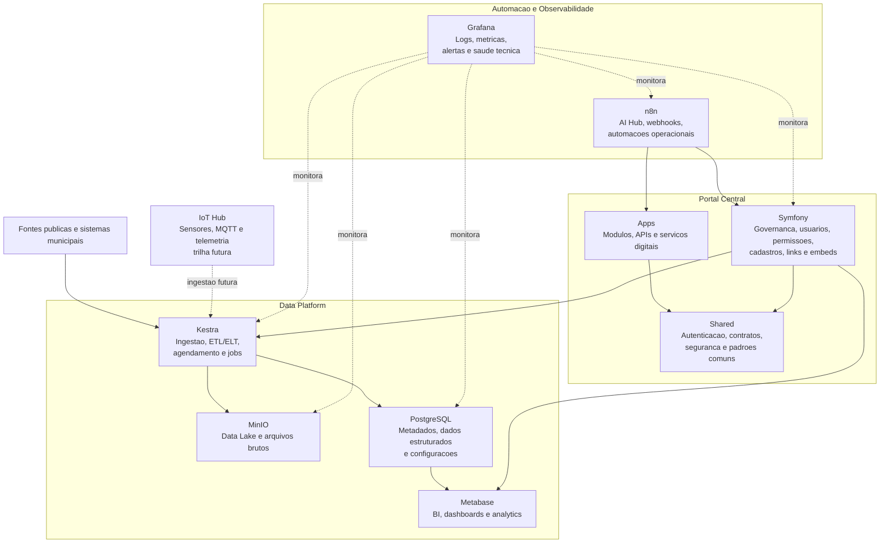

# Plataforma360

Plataforma360 e a base open source instalavel do projeto Olinda360: uma GovTech para inteligencia territorial, turismo inteligente, APIs publicas, analytics, dados abertos e interoperabilidade municipal.

A plataforma nao e SaaS. O objetivo e permitir que prefeituras, laboratorios de inovacao e equipes tecnicas instalem o ambiente localmente ou em VPS propria, mantendo autonomia sobre dados, infraestrutura e evolucao.

## Arquitetura

O desenho da Plataforma360 separa governanca, dados, BI, observabilidade e automacoes especializadas para evitar sobreposicao de funcoes.



- `Symfony`: portal central de governanca e configuracao da plataforma.
- `Kestra`: orquestracao de dados, ingestao, ETL/ELT e automacoes tecnicas.
- `Metabase`: BI, dashboards e analytics de negocio.
- `Grafana`: observabilidade tecnica, logs, metricas e alertas.
- `PostgreSQL`: banco relacional principal e banco de metadados.
- `MinIO`: armazenamento de objetos e data lake.
- `n8n`: AI Hub e automacoes operacionais fora da data platform.
- `IoT Hub`: trilha futura para sensores, telemetria e eventos.
- `Apps`: modulos funcionais da plataforma.
- `Shared`: autenticacao, contratos, seguranca, observabilidade compartilhada e padroes comuns.

Detalhamento arquitetural oficial em `docs/arquitetura.md`.

## Requisitos

- Git
- Docker
- Docker Compose v2
- Make, em Linux/macOS ou WSL

## Instalacao

```bash
git clone <repo-url> Plataforma360
cd Plataforma360
cp .env.example .env
make install
```

Apos subir o ambiente:

- Aplicacao: http://localhost:8080
- OpenAPI/Swagger: http://localhost:8080/api
- Healthcheck: http://localhost:8080/health
- Adminer: http://localhost:8081

Credenciais padrao do banco:

- Servidor: `postgres`
- Banco: `plataforma360`
- Usuario: `plataforma360`
- Senha: `plataforma360`

## Data Platform com Kestra

O Kestra passa a ser a camada inicial de ingestao, automacao de pipelines e orquestracao de dados da Plataforma360. Ele roda em stack separada no arquivo `docker-compose.kestra.yml`, preservando o ambiente principal do Symfony e mantendo a arquitetura modular.

Papel de cada componente na trilha de dados:

- `Kestra`: agenda, executa e monitora fluxos de ingestao e automacao.
- `MinIO`: recebe os arquivos brutos e historico de ingestao.
- `PostgreSQL`: recebe dados tratados, metadados e configuracoes estruturadas.
- `Metabase`: consome dados tratados para indicadores, dashboards e analytics de negocio.
- `Symfony + API Platform`: expoe servicos, APIs publicas, governanca e interfaces operacionais sobre os dados tratados.
- `Grafana`: monitora a saude tecnica da stack.
- `n8n`: permanece no AI Hub para automacoes operacionais, webhooks e IA.

Subida local do Kestra:

```bash
docker compose -f docker-compose.kestra.yml up -d
```

Com o stack ativo:

- Kestra UI: http://localhost:8082/ui/
- Compose modular: `docker-compose.kestra.yml`
- Fluxo inicial de exemplo: `future/kestra/flows/olinda360_primeira_ingestao.yml`
- Manual operacional: `docs/manual-kestra.md`

## Comandos Docker

```bash
make up       # sobe os containers
make down     # para os containers
make restart  # reinicia os containers
make logs     # acompanha logs
make bash     # shell no container PHP
make migrate  # executa migrations Doctrine
make kestra-up       # sobe o stack modular do Kestra
make kestra-down     # para o stack do Kestra
make kestra-logs     # acompanha logs do Kestra
make kestra-restart  # reinicia o stack do Kestra
```

## Estrutura

```text
Plataforma360/
├── apps/core/
├── infra/
├── docs/
├── scripts/
├── data/
├── future/
├── docker-compose.yml
├── .env.example
├── Makefile
└── README.md
```

## Roadmap Inicial

1. Consolidar modelo territorial e catalogo de dados publicos.
2. Evoluir APIs publicas versionadas e documentadas por OpenAPI.
3. Adicionar dashboards territoriais e turisticos.
4. Integrar observabilidade com logs, metricas e traces.
5. Preparar camada MCP e IA para consulta contextual aos dados municipais.
6. Implantar conectores de interoperabilidade com sistemas publicos.

## Licenca

Distribuicao prevista como projeto open source para instalacao local por municipios e comunidades tecnicas.