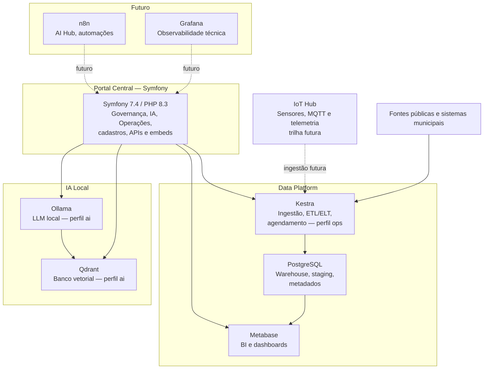

# Plataforma360

Plataforma360 é a base open source instalável do projeto Olinda360: uma GovTech para inteligência territorial, turismo inteligente, APIs públicas, analytics, dados abertos e interoperabilidade municipal.

A plataforma não é SaaS. O objetivo é permitir que prefeituras, laboratórios de inovação e equipes técnicas instalem o ambiente localmente ou em VPS própria, mantendo autonomia sobre dados, infraestrutura e evolução.

## Arquitetura

O desenho da Plataforma360 separa governança, dados, BI, IA e automações para evitar sobreposição de funções.



Detalhamento arquitetural completo em [docs/arquitetura.md](docs/arquitetura.md).

## Requisitos

- Git
- Docker + Docker Compose v2
- Make (Linux/macOS/WSL)

## Instalação

```bash
git clone <repo-url> Plataforma360
cd Plataforma360
cp .env.example .env
make install
```

Após subir o ambiente:

| URL | Serviço |
|---|---|
| http://localhost | Portal Symfony |
| http://localhost/api | OpenAPI / Swagger |
| http://localhost/health | Healthcheck |
| http://localhost:3000 | Metabase |

Credenciais padrão do banco: servidor `postgres`, banco/usuário/senha `app`.

Consulte [docs/instalacao.md](docs/instalacao.md) para o guia completo de instalação.

## Perfis Docker

A plataforma usa perfis Docker para ativar serviços opcionais:

```bash
make up        # Core: Symfony, PostgreSQL, Nginx, Metabase
make up-ai     # Core + Ollama (11434) + Qdrant (6333)
make up-ops    # Core + Kestra (8082) + kestra-postgres
make up-all    # Tudo: Core + IA + Ops
```

Com o perfil `ops` ativo:
- Kestra UI: http://localhost:8082/ui/
- Flows de exemplo: `future/kestra/flows/`
- Manual técnico: [docs/manual-kestra.md](docs/manual-kestra.md)

Com o perfil `ai` ativo:
- Ollama API: http://localhost:11434
- Qdrant Dashboard: http://localhost:6333/dashboard
- Manual técnico: [docs/manual-ia.md](docs/manual-ia.md)

## Comandos Make

```bash
make up          # Sobe os containers core
make down        # Para os containers
make restart     # Reinicia os containers
make logs        # Acompanha logs
make bash        # Shell no container PHP
make migrate     # Executa migrations Doctrine

make up-ai       # Sobe Ollama + Qdrant
make down-ai     # Para Ollama + Qdrant
make up-ops      # Sobe Kestra + kestra-postgres
make down-ops    # Para Kestra
make up-all      # Sobe tudo
make down-all    # Para tudo

make kestra-logs     # Logs do Kestra
make kestra-restart  # Reinicia o Kestra
```

## Estrutura do Projeto

```text
Plataforma360/
├── apps/core/          ← Aplicação Symfony principal
│   ├── src/            ← PHP: entidades, services, controllers
│   ├── templates/      ← Twig + Bootstrap 5.3
│   ├── migrations/     ← Doctrine migrations versionadas
│   └── assets/         ← JS/CSS via importmap
├── future/
│   └── kestra/
│       ├── flows/      ← Flows YAML do Kestra
│       └── examples/   ← Dados de exemplo
├── infra/              ← Nginx, PHP Dockerfile, PostgreSQL init
├── docs/               ← Documentação completa (ver abaixo)
├── data/               ← raw/, staging/, processed/
├── storage/            ← Arquivos físicos ingeridos
├── .github/            ← Agentes, skills e instructions do Copilot
├── docker-compose.yml
├── Makefile
└── .env.example
```

## Fases Implementadas

| Fase | Descrição | Status |
|---|---|---|
| 1 | Core instalável (Docker, Symfony, PostgreSQL) | ✅ |
| 2 | Dados territoriais e pipeline CKAN | ✅ |
| 3 | Analytics e catálogo de datasets | ✅ |
| 4 | Data Warehouse, Metabase, APIs analíticas | ✅ |
| 5 | IA híbrida (Ollama local + OpenAI) | ✅ |
| 6 | Operações, Governança, Observabilidade | ✅ |
| 7 | Realtime, Event Bus, IoT Hub | Futuro |
| 8 | Interoperabilidade e IA Avançada | Futuro |

Roadmap detalhado em [docs/roadmap.md](docs/roadmap.md).

## Documentação

| Documento | Público | Descrição |
|---|---|---|
| [docs/instalacao.md](docs/instalacao.md) | Dev / DevOps | Guia completo de instalação e configuração |
| [docs/arquitetura.md](docs/arquitetura.md) | Dev / Arquiteto | Decisões arquiteturais, matriz de responsabilidades |
| [docs/manual-usuario.md](docs/manual-usuario.md) | Gestor público | Passo a passo de uso: da ingestão aos dashboards e IA |
| [docs/manual-kestra.md](docs/manual-kestra.md) | Dev / Ops | Manual técnico do Kestra: flows, API, integração Symfony |
| [docs/manual-ia.md](docs/manual-ia.md) | Dev / Técnico | Manual técnico da IA: Ollama, Qdrant, modelos, contextos |
| [docs/manual-agentes.md](docs/manual-agentes.md) | Dev | Guia de uso dos agentes e skills do GitHub Copilot |
| [docs/roadmap.md](docs/roadmap.md) | Time de produto | Fases implementadas e planejadas |

## Agentes Copilot

O projeto inclui agentes e skills do GitHub Copilot configurados em `.github/` para acelerar o desenvolvimento:

```
@Plataforma360        → Agente principal (orquestrador)
@Backend Symfony      → Entidades, services, controllers, migrations
@Frontend Twig        → Templates, componentes Bootstrap, navbar
@Dados e Pipeline     → CKAN, warehouse, flows Kestra
@Módulo IA            → Ollama, OpenAI, Qdrant, embeddings
@Operações e Governança → Pipelines, alertas, LGPD, auditoria

/nova-entidade        → Criar entidade + repository + migration
/novo-modulo          → Criar módulo CRUD completo
/kestra-flow          → Criar flow Kestra + registrar no portal
```

Manual completo em [docs/manual-agentes.md](docs/manual-agentes.md).

## Licença

Distribuição prevista como projeto open source para instalação local por municípios e comunidades técnicas.
